<!-- MMU LOGO -->

 
  
  
 <h2>TCC3141 Cloud Computing</h2>
 <h2>Trimester 2 2021/2022</h2>
 <h2>Project Title: Health Tracking System</h2>
  
  
 <table>
  <tr>
    <th>Student ID</th>
    <th>Student Name</th>
  </tr>
  <tr>
    <td>1171203702</td>
    <td>Feu Che Sung</td>
  </tr>
  <tr>
    <td>1171203853</td>
    <td>Lim Hui Fang</td>
   </tr>
  <tr>
    <td>1171203781</td>
    <td>Kiew En Tong</td>
  </tr>
  <tr>
    <td>1171203668</td>
    <td>Koh Jun Hong</td>
  </tr>
  <tr>
    <td>1171203759</td>
    <td>Tan Kah Feng</td>
  </tr>
 </table>
  
  
 <h2>Prepare for: Ms. Siti Zainab Binti Ibrahim</h2>

<!-- TABLE OF CONTENTS -->
## Table of Contents

  
Table of Contents

  <ol>
    <li>
      <a href="#about-the-project">About The Project</a>
    </li> 
     <li><a href="#built-with">Built With</a></li>  
     <li><a href="#User_Manual">User Manual</a></li>
     <li><a href="#license">License</a></li>
     <li><a href="#contact">Contact</a></li>
     <li><a href="#acknowledgments">Acknowledgments</a></li>
  </ol>

<!-- ABOUT THE PROJECT -->
## About The Project

<h3>1. MIT App Inventor</h3>
 

  <a href="https://github.com/Feucs/cloudcomputing/images/logo.png">
    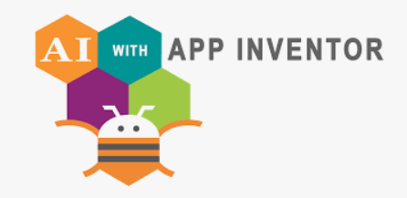
  </a>
 

  
  

    An awesome MIT App Inventor to start your projects!
  

   

<h3>2. Health Tracking System</h3>

  
  
 

                                                                   

There are many great README templates available on GitHub; however, I didn't find one that really suited my needs so I created this enhanced one. I want to create a README template so amazing that it'll be the last one you ever need -- I think this is it.

Here's why:
* Your time should be focused on creating something amazing. A project that solves a problem and helps others
* You shouldn't be doing the same tasks over and over like creating a README from scratch
* You should implement DRY principles to the rest of your life :smile:

Of course, no one template will serve all projects since your needs may be different. So I'll be adding more in the near future. You may also suggest changes by forking this repo and creating a pull request or opening an issue. Thanks to all the people have contributed to expanding this template!

Use the `BLANK_README.md` to get started.

(<a href="#top">back to top</a>)

## Built With

This section should list any major frameworks/libraries used to bootstrap your project. Leave any add-ons/plugins for the acknowledgements section. Here are a few examples.

* [Next.js](https://nextjs.org/)
* [React.js](https://reactjs.org/)
* [Vue.js](https://vuejs.org/)
* [Angular](https://angular.io/)
* [Svelte](https://svelte.dev/)
* [Laravel](https://laravel.com)
* [Bootstrap](https://getbootstrap.com)
* [JQuery](https://jquery.com)

(<a href="#top">back to top</a>)

<!-- User Manual -->
## User_Manual

Step 1 : aaaaaaaa

 

  <a href="https://github.com/Feucs/cloudcomputing/blob/main/images/1.png">
    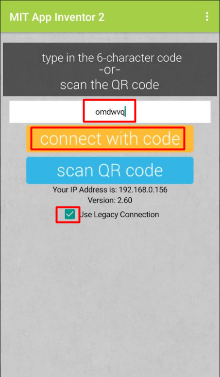
  </a>
 

  
 

Step 2 : aaaaaaaa

 

  <a href="https://github.com/Feucs/cloudcomputing/blob/main/images/2.png">
    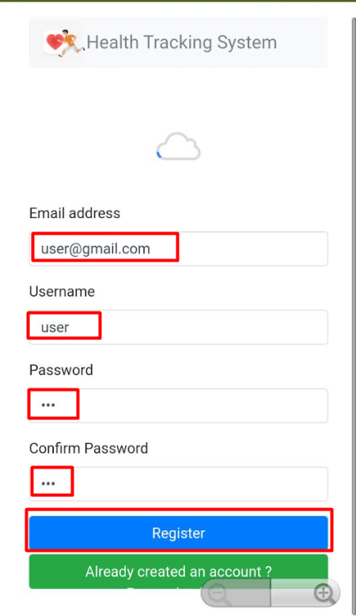
  <a href="https://github.com/Feucs/cloudcomputing/blob/main/images/2.1.png">
    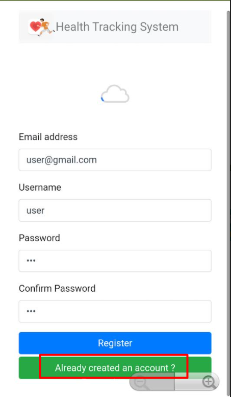
  </a>
 

  
  

Step 3 : aaaaaaaa

 

  <a href="https://github.com/Feucs/cloudcomputing/blob/main/images/3.png">
    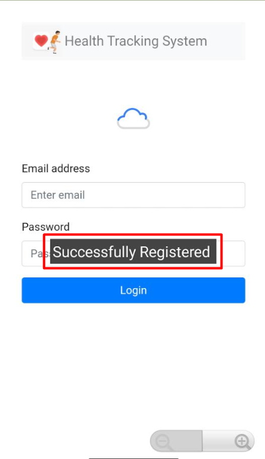
  </a>
  

  
 
 
Step 4 : aaaaaaaa

 

  <a href="https://github.com/Feucs/cloudcomputing/blob/main/images/4.png">
    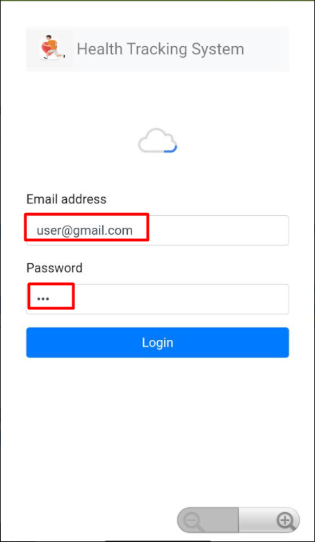
  </a>
  

  
 
 
Step 5 : aaaaaaaa

 

  <a href="https://github.com/Feucs/cloudcomputing/blob/main/images/5.png">
    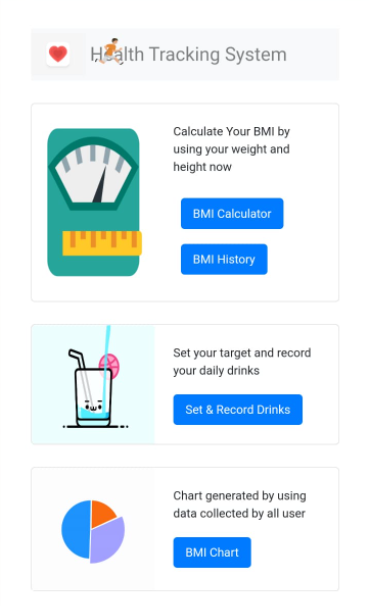
  </a>
  

   
  
 
Step 6 : aaaaaaaa

 

  <a href="https://github.com/Feucs/cloudcomputing/blob/main/images/6.png">
    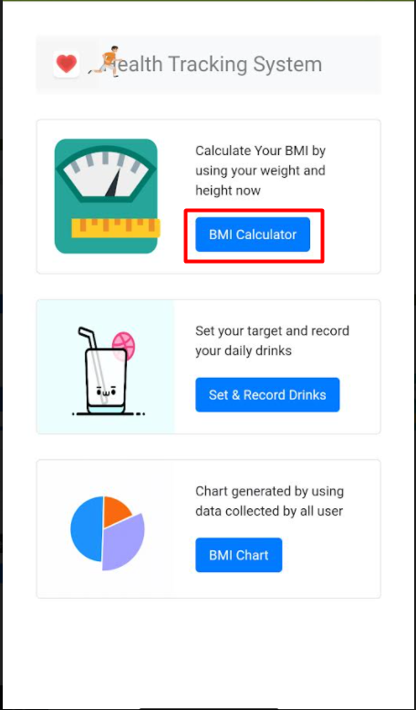
  </a>
  

   
  
 
Step 7 : aaaaaaaa

 

  <a href="https://github.com/Feucs/cloudcomputing/blob/main/images/7.png">
    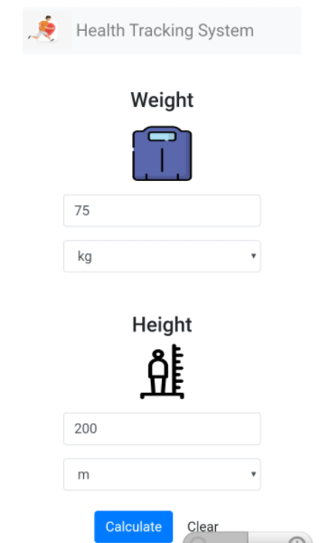
  </a>
  

  
  
 
Step 8 : aaaaaaaa

 

  <a href="https://github.com/Feucs/cloudcomputing/blob/main/images/8.png">
    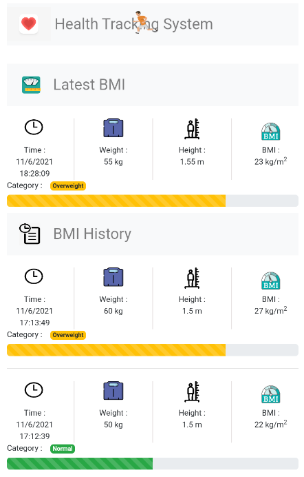
  </a>
  

  
  
 
Step 9 : aaaaaaaa

 

  <a href="https://github.com/Feucs/cloudcomputing/blob/main/images/9.png">
    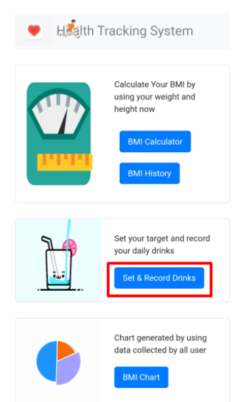
  </a>
  

  
  
 
Step 10 : aaaaaaaa

 

  <a href="https://github.com/Feucs/cloudcomputing/blob/main/images/10.png">
    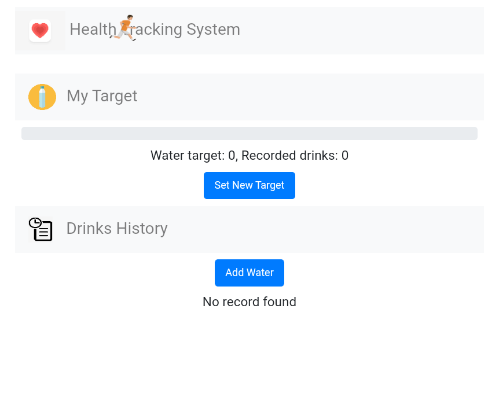
  </a>
  

  
 
 
Step 11 : aaaaaaaa

 

  <a href="https://github.com/Feucs/cloudcomputing/blob/main/images/11.png">
    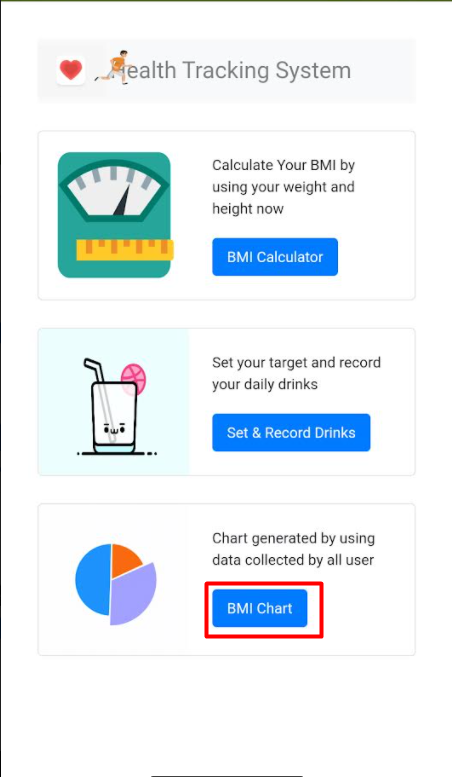
  </a>
  

  
  
 
Step 12 : aaaaaaaa

 

  <a href="https://github.com/Feucs/cloudcomputing/blob/main/images/12.png">
    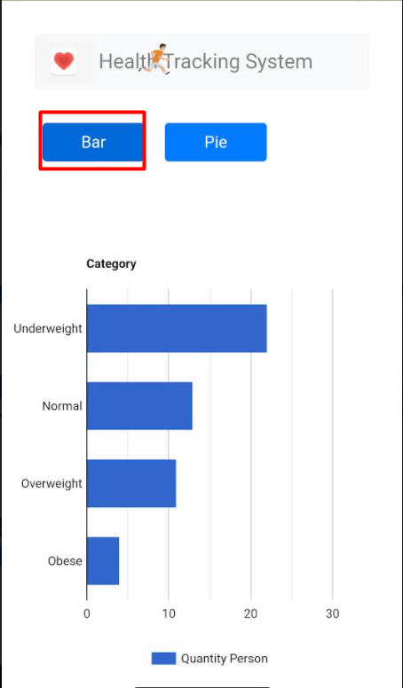
  </a>
  

  
  
 
Step 13 : aaaaaaaa

 

  <a href="https://github.com/Feucs/cloudcomputing/blob/main/images/13.png">
    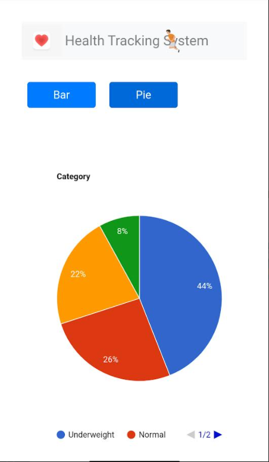
  </a>
  

(<a href="#top">back to top</a>)

<!-- LICENSE -->
## License

Distributed under the MIT License. See <a href="https://github.com/Feucs/cloudcomputing/blob/main/LICENSE">`LICENSE`</a> for more information.
                                

(<a href="#top">back to top</a>)

<!-- CONTACT -->
## Contact

Your Name - [@your_twitter](https://twitter.com/your_username) - email@example.com

Project Link: [https://github.com/your_username/repo_name](https://github.com/your_username/repo_name)

(<a href="#top">back to top</a>)

  
 <!-- ACKNOWLEDGMENTS -->
## Acknowledgments

Use this space to list resources you find helpful and would like to give credit to. I've included a few of my favorites to kick things off!

* [Choose an Open Source License](https://choosealicense.com)
* [GitHub Emoji Cheat Sheet](https://www.webpagefx.com/tools/emoji-cheat-sheet)
* [Malven's Flexbox Cheatsheet](https://flexbox.malven.co/)
* [Malven's Grid Cheatsheet](https://grid.malven.co/)
* [Img Shields](https://shields.io)
* [GitHub Pages](https://pages.github.com)
* [Font Awesome](https://fontawesome.com)
* [React Icons](https://react-icons.github.io/react-icons/search)

(<a href="#top">back to top</a>)

  
