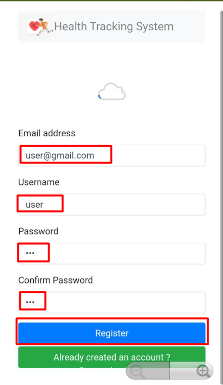
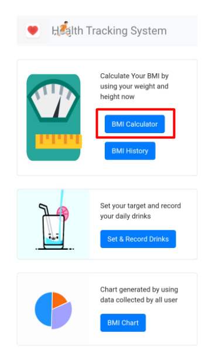
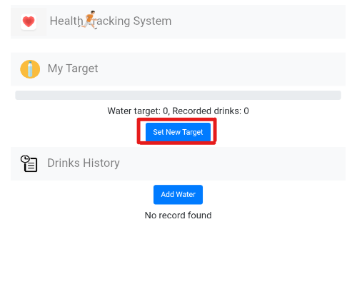
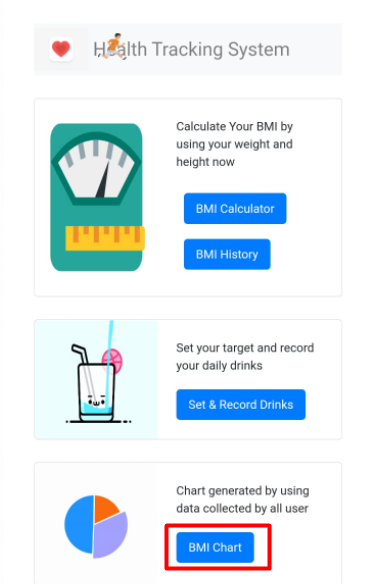
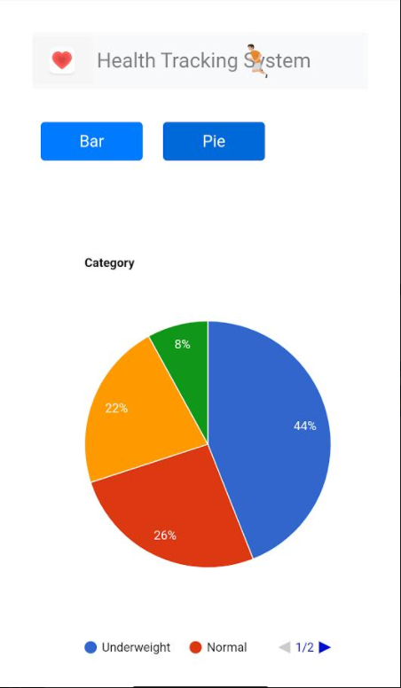

<!-- Usage Manual -->
## Usage Manual

<!-- TABLE OF CONTENTS -->
## Table of Contents

  
Table of Contents

  <ol>
    <li>
      <a href="#connect-to-ai-companion">Connect to AI Companion</a>
    </li> 
     <li><a href="#export-to-apk-file">Export to apk file</a></li>  
     <li><a href="#register-&-login">Register & Login</a></li>  
     <li><a href="#health-dashboard">Health Dashboard</a></li>
     <li><a href="#bmi">BMI</a></li>  
     <li><a href="#record water">Record Water</a></li>
     <li><a href="#charts">Charts</a></li>
     
  </ol>

## Connect to AI Companion

Step 1 : Go to <a href="http://ai2.appinventor.mit.edu">MIT Website</a>, and click "Project"-> "Import project (.aia) from my computer", please download <a href="https://github.com/Feucs/cloudcomputing/blob/main/Version14(Latest).aia">Health Monitoring System</a>.aia file before that.

 

  
  
 

  
 
 
Step 2 : Open the project and click "Connect"-> "AI Companion".

 

  
  
 

  
 
 
Step 3 : Get the code.

 

  
 

  
 

Step 4 : Type in the code, and make sure use legacy connection the click the "connect with code" in your andriod phone's <a href="https://play.google.com/store/apps/details?id=edu.mit.appinventor.aicompanion3&hl=en&gl=US">MIT App Inventor</a>.

 

  
 

  
 
 ## Export to apk file
 
 
Step 1 : If you want to export to apk file, click "Build" -> "Android App (.apk)".

 

  
 

  
 
  
Step 2 : After compiling to apk file, both choices are shown as below. The first choice is click the button to download the app, right-click on it to copy a download link. The second choice is scan the code with a barcode scanner to install.

 

  
 

  
 
 ## Register & Login 
 
 
After connect to AI Companion or installed the apk file, you should access our Health Tracking System successfully. The first screen you will see is Register & Login screen.

Step 1 : For new user, you need to fill in the required information, and the click on the "Register", or else choose "Already created an account?" if you have already done for registration.

 

  <a href="https://github.com/Feucs/cloudcomputing/blob/main/images/2.png">
    
  
 

  
  

Step 2 : For new user, you can see the "Successfully Registered" after account registration.

 

  
  

  
 
 
Step 3 : After the registration, user need to login to their account by type in their "Email address" and "Password" in order to login.

 

  
  

  
 
 ## Health Dashboard
 
 
After success to login your account, you can see the all funtion of this system at the homepage. It have BMI Calculator, Drink Recorder, and Charts.

 

  
  

   
  
 ## BMI
 
 
Step 1 : First, choose the "BMI Calculate".

 

  
  

   
  
 
Step 2: Key in weight and height and click "Calculcate" button.

 

  
  

  
  
 
Step 3 : After that, user can view their BMI status in the "Latest BMI" or they can view other history on "BMI History" if they have calculate more than once.

 

  
  

  
 
 ## Record Water
  
 
Step 1 : Select "Set & Record Drinks" if user want to record their daily drinks.

 

  
  

  
  
 
Step 2 : After that, the screen will showing empty target and empty drinks if they are new users. In order to set the target, user can click on "Set new target".

 

  
  

  
 

Step 4 : User can key in the target they want.

 

  
  

  

 
Step 5 : After submit their target, user can record their daily drink consumption after click on the  "Add Water" on first page.

 

  
  
  

  
 
 
Step 6 : After add the water, user can view their drink history and also the total drink.

 

  
  

  
 
 ## Charts
 
 
Step 1 : Click "BMI Chart".

 

  
  

  
  
 
Step 2 : User can choose either "Bar" or "Pie".

 

  
  

  
  
 
Step 3 : User can see the BMI record of all user in this system

 

  
  

(<a href="#top">back to top</a>)

