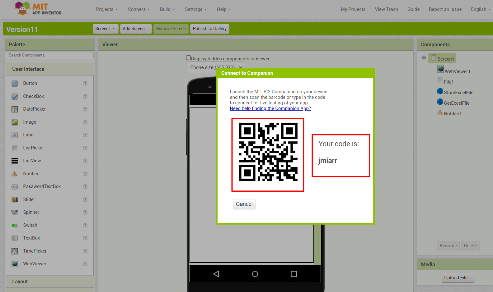
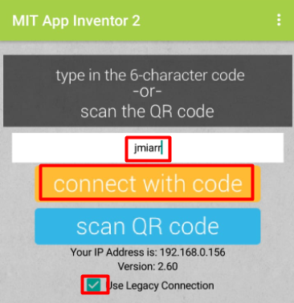
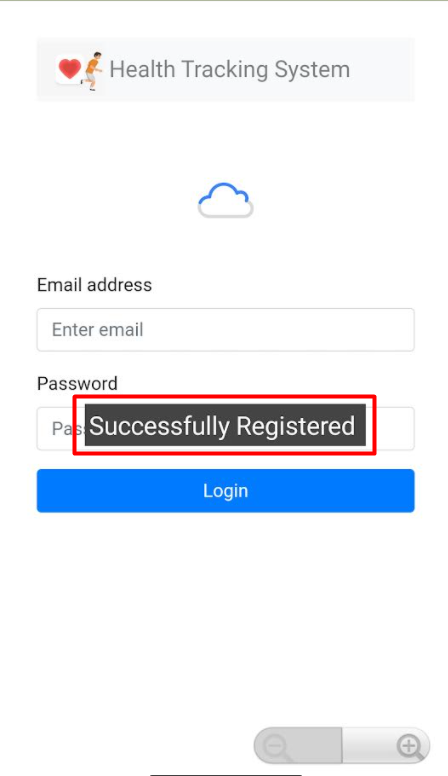
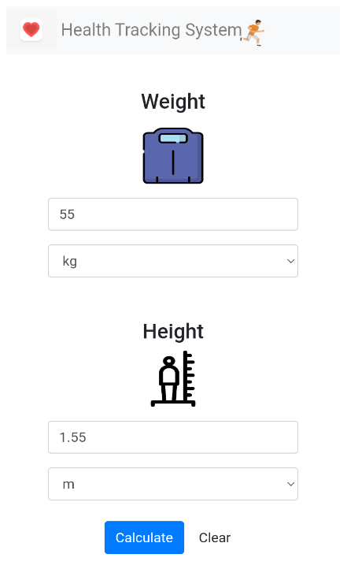
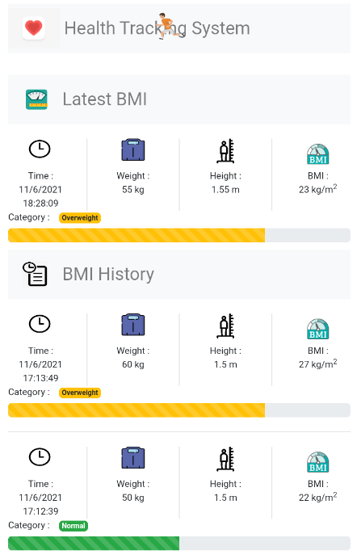
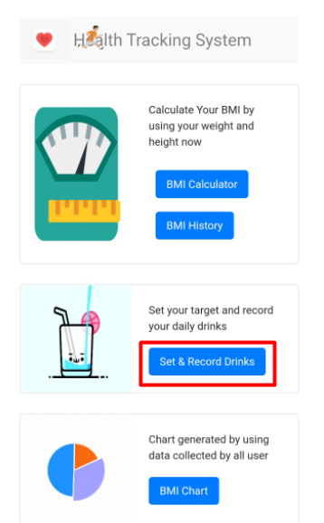
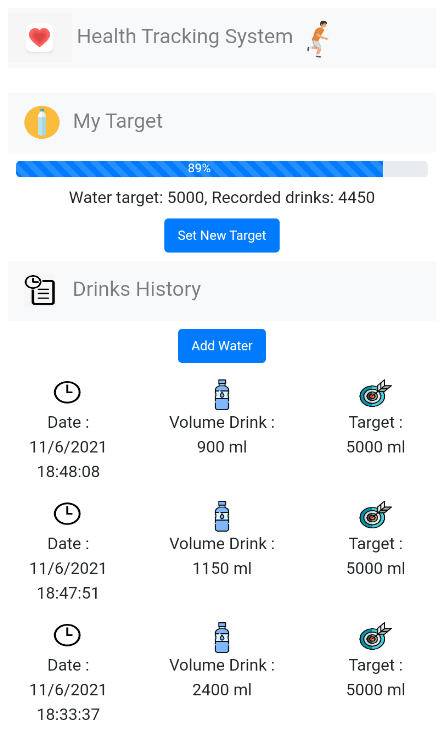

<!-- Usage Manual -->
## Usage Manual

Step 1 : Go to <a href="http://ai2.appinventor.mit.edu">MIT Website</a>, and click "Project"-> "Import project (.aia) from my computer".

 

  
  
 

  
 
 
Step 2 : Open the project and click "Connect"-> "AI Companion".

 

  
  
 

  
 
 
Step 3 : Get the code.

 

  
 

  
 

Step 4 : Type in the code, and makesure use legacy coonection the click the "connect with code" in your andriod phone's <a href="https://play.google.com/store/apps/details?id=edu.mit.appinventor.aicompanion3&hl=en&gl=US">MIT App Inventor</a>.

 

  
 

  
 

Step 5 : For new user need to fill in the required information the click the "Register" else choose "Already created an account?".

 

  <a href="https://github.com/Feucs/cloudcomputing/blob/main/images/2.png">
    
  
 

  
  

Step 6 : For new user, you can see the "Successfully Registered" after account regitration.

 

  
  

  
 
 
Step 7 : At the login page, user need to type in their "Email address" and "Password" then login.

 

  
  

  
 
 
Step 8 : At the homepage, user can see the all funtion of this system.

 

  
  

   
  
 
Step 9 : First, choose the "BMI Calculate".

 

  
  

   
  
 
Step 10: Type in your weight and height the click the "Calculate".

 

  
  

  
  
 
Step 11 : User can view their history of BMI.

 

  
  

  
  
 
Step 12 : Second, choose the "Set & Record Drinks".

 

  
  

  
  
 
Step 13 : User can set their target then click the "SUBMIT".

 

  
  

  
 
 
Step 14 : User can set the drink.

 

  
  

  
 
 
Step 15 : User can view their drink history.

 

  
  

  
 
 
Step 16 : Third, choose the "BMI Chart".

 

  
  

  
  
 
Step 17 : User can choose either "Bar" or "Pie".

 

  
  

  
  
 
Step 18 : User can see the BMI record of all user in this system

 

  
  

(<a href="#top">back to top</a>)

